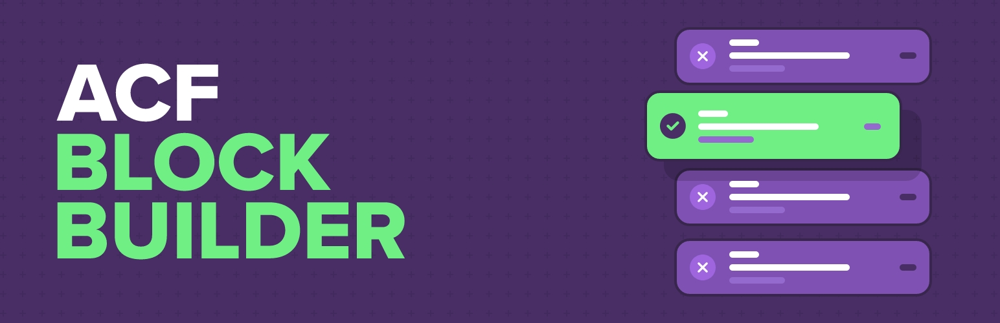

# ACF Block Builder

A WordPress plugin that allows you to create and manage ACF Blocks using AI and an internal code editor.

## Setup

1. Get your Google Gemini API key from [Google AI Studio](https://aistudio.google.com/app/apikey)
2. Go to ACF Block Builder > Settings in your WordPress admin
3. Enter your API key and configure your settings
4. Start generating new ACF Blocks

## Version 1.6.0 Changes
- UPDATE: Ability to stop AI generation
- UPDATE: Improvements to AI prompting
- NEW: Ability to set custom global instructions
- NEW: Include ACF Field types in @mentions
- UPDATE: Only show changed files in AI changes overview
- FIX: Improvements to AI model selector dropdown

## Version 1.5.0 Changes
- NEW: @mentions: Ability to @mention files, posts, taxonomies, field groups, fields and send the context of those objects directly to AI
- NEW: Smart chips: Smart chips give you quick access to files and useful context information in the chat window
- UPDATE: Issues list now uses the @mentions tokens

## Version 1.4.0 Changes
- NEW: Linting for json, css & html
- NEW: PHP parsing
- NEW: Issues list 

## Version 1.3.0 Changes
- NEW: Support for multiple LLM models

## Version 1.2.0 Changes
- FIX: Resolved duplicate chat summaries in chat window
- UPDATE: Overhauled the chat window
- UPDATE: Previous chat history is sent with new message
- NEW: Option to clear chat history
- NEW: Version control individual files
- NEW: Version control AI chat completions per file

## Version 1.1.0 Changes
- Added live steaming of response from AI for a more intuitive experience
- Code and tasks widgets in chat to separate conversation flow

## Version 1.0.6 Changes
- Updates to styling on settings screen

## Version 1.0.5 Changes
- Updates to styling on edit block screen
- AI summary given in chat window

## Version 1.0.4 Changes

- Improvements to error logging and debugging

## Version 1.0.3 Changes

- Improve AI prompt for handling array values
- Check to ensure ACF PRO 6.7.0 or greater is active

## Version 1.0.2 Changes

- Resolve issue with updater

## Version 1.0.1 Changes

- Version bump for update checker

## Version 1.0.0 Changes

- Initial plugin release